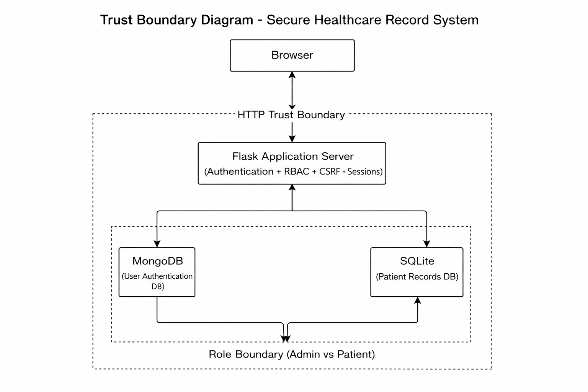
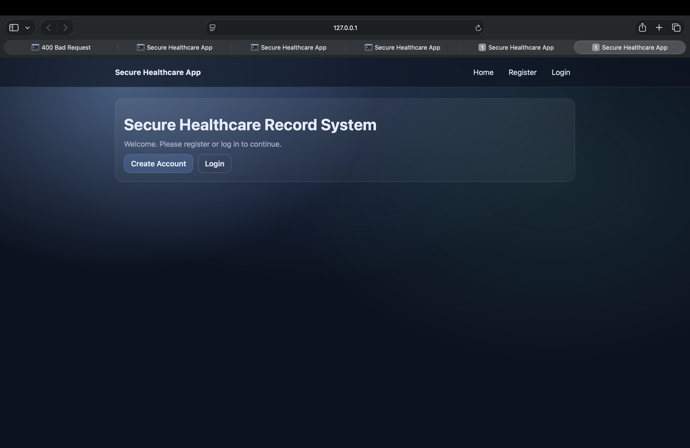
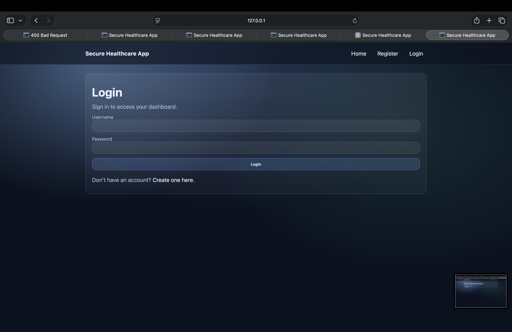
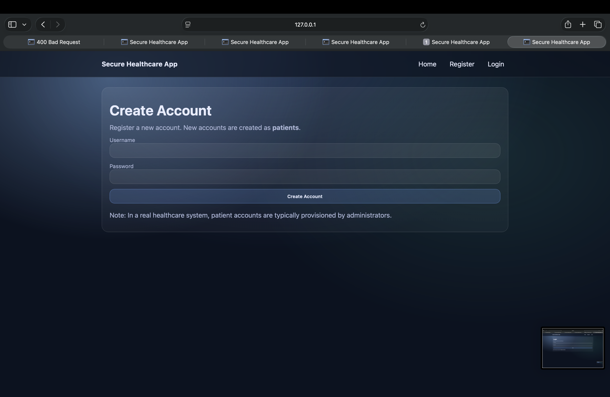
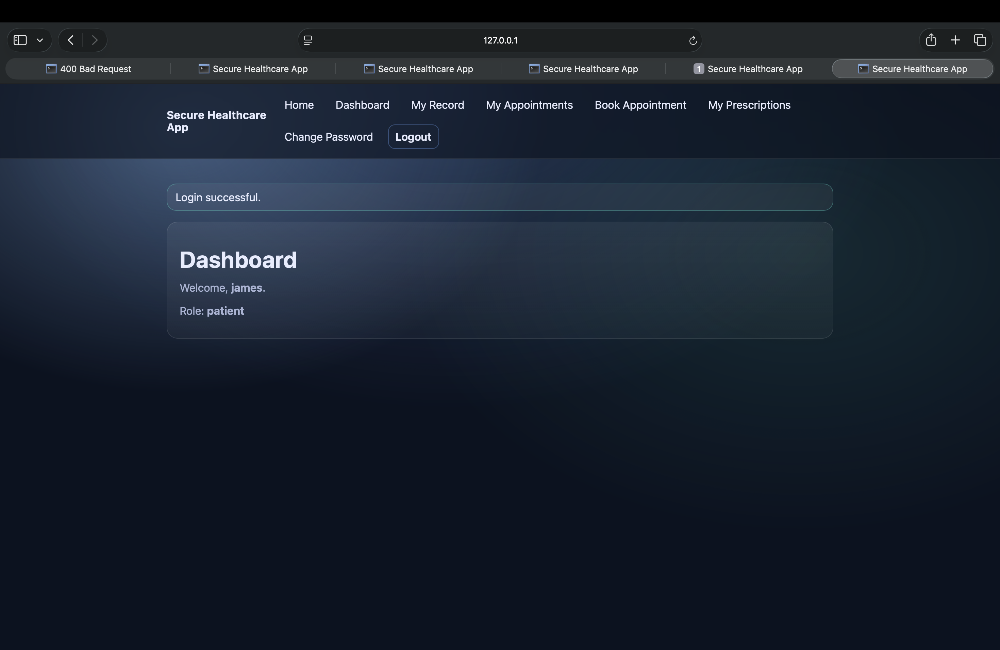
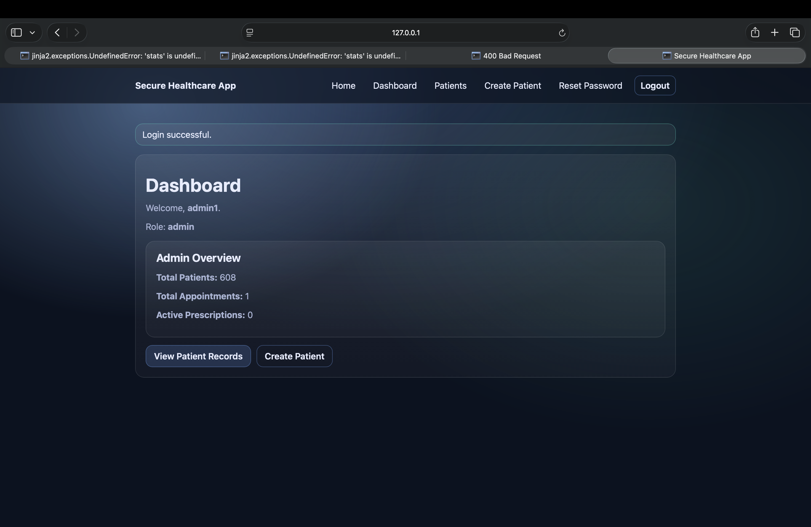
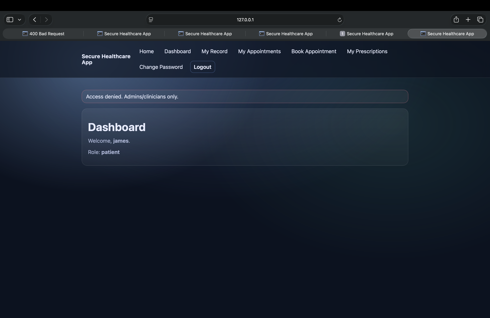
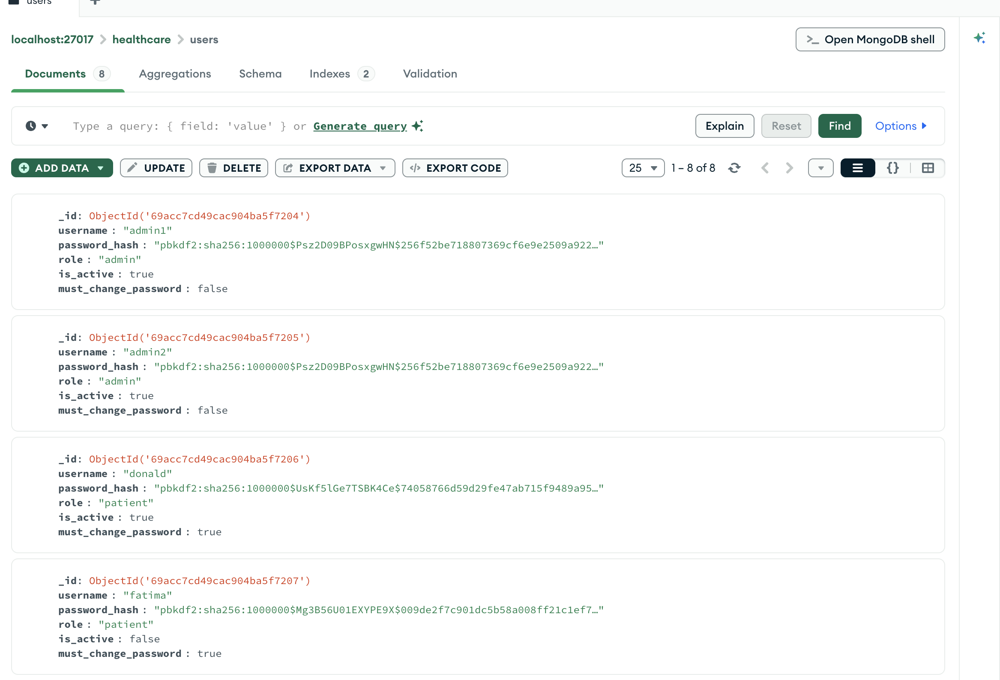
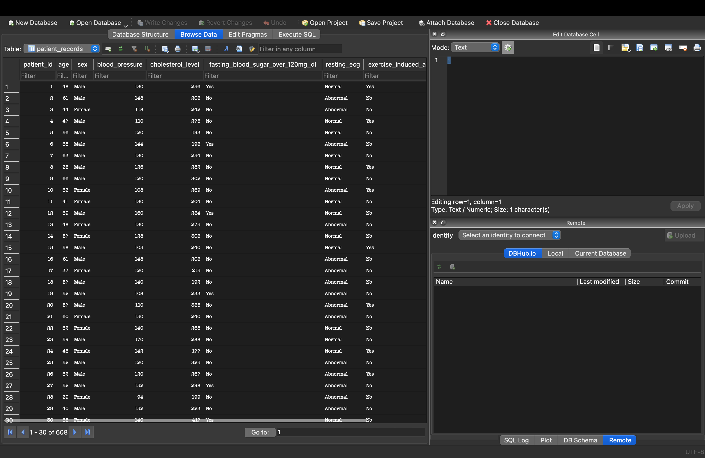
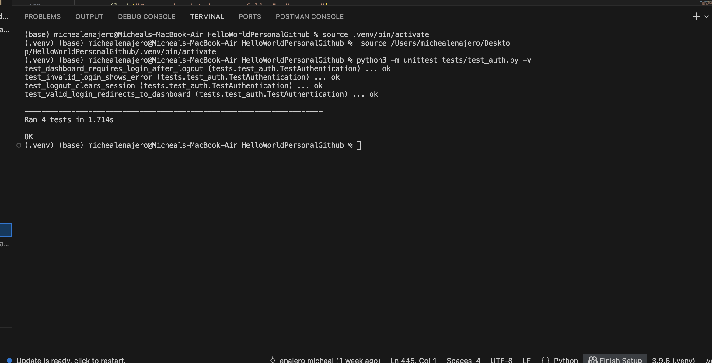

# Secure Healthcare Record System (Flask + SQLite + MongoDB)

A secure web application demonstrating authentication, role-based access control (RBAC), and secure handling of patient records.

## Tech Stack
- **Flask (Python)** – web server and routing
- **MongoDB** – user authentication store (username + password hash + role)
- **SQLite** – patient records database
- **Flask-Talisman** – security headers (CSP, HSTS, clickjacking protection)
- **Flask-WTF CSRF** – CSRF protection for form submissions
- **python-dotenv** – environment variable loading

---
## GitHub Repository

Project Source Code:  
https://github.com/enajeromicheal/secure-healthcare-app

## Features
- User registration (MongoDB)
- User login + session handling
- Dashboard showing logged-in user + role
- **RBAC:** `/patients` is **admin-only**
- Patient records stored in SQLite
- MongoDB health-check endpoint (for diagnostics)

---

## Security Controls Implemented
- Password hashing using PBKDF2 (Werkzeug)
- Unique username enforcement (MongoDB unique index)
- Session-based authentication with protected routes
- Role-based access control (admin-only patients page)
- CSRF protection for forms
- Secure HTTP headers via Flask-Talisman (CSP, HSTS, X-Frame-Options)
- SECRET_KEY stored in environment variable (not hard-coded)
## Security Design Documents

- STRIDE Threat Model → docs/threat_model_stride.md  
- Security Evaluation → docs/evaluation_and_residual_risk.md  
- Deployment Guide → docs/deployment.md  

### Trust Boundary Diagram


## How to Run the System

1. Clone the project

git clone <your-github-link>

cd HelloWorldPersonalGithub


2. Create virtual environment

python3 -m venv .venv  
source .venv/bin/activate


3. Install dependencies

pip install -r requirements.txt


4. Create `.env` file

Add:

SECRET_KEY=your_secret_key  
MONGO_URI=mongodb://localhost:27017/healthcare


5. Setup SQLite database

python sqlite_setup.py


6. Seed users

python scripts/seed_users.py


7. Run application

python app.py

Open browser:

http://127.0.0.1:5000

## Running Tests

Run authentication and RBAC tests:

python -m unittest discover tests -v
---
## System Screenshots

### Home Page


### Login Page


### Register Page


### Dashboard After Login


### Admin Patients Page


### Access Denied Page (RBAC Protection)


### MongoDB Users Collection


### SQLite Patient Records Table


### Terminal Tests Passing

## Project Structure
```text
.
├── app.py
├── db/
│   ├── mongo.py
│   └── users_mongo.py
├── templates/
├── static/
├── docs/
│   ├── threat_model_stride.md
│   ├── trust_boundary_diagram.png
│   └── evaluation_and_residual_risk.md
├── sqlite_setup.py
├── requirements.txt
└── README.md